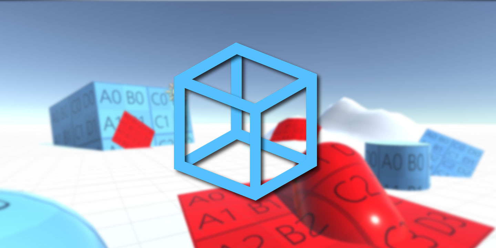
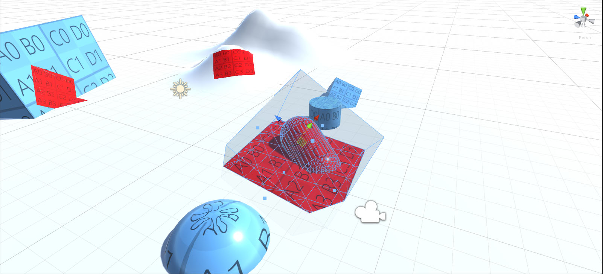
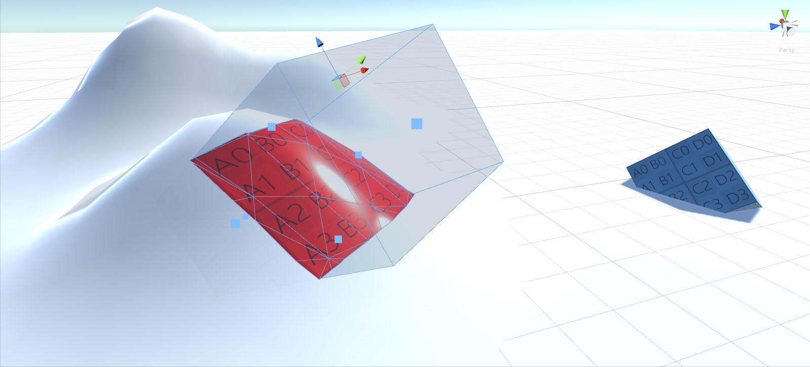

# Simple Decal Mesh (Experimental/Beta)

- [About](#about)
- [Example usage](#showcase)
- [Also](#also)

# About

|  |
| :---: |
| **Simple Decal Mesh** |

**Simple Decal Mesh** it is simple tool for [Unity3d](https://unity3d.com/)
to creating Static Decal Meshes in scene.
It's provides a one new component: **Decal Volume**.

| Version | Description |
| --- | --- |
| **0.0.4.1** | Experimental/Beta |

# Showcase
It is example how it's worked.

|  |
| :---: |
| Work with static mesh. |

|  |
| :---: |
| Work with terrains. |

---
[Move up](#simple-light-probe-placer)

---